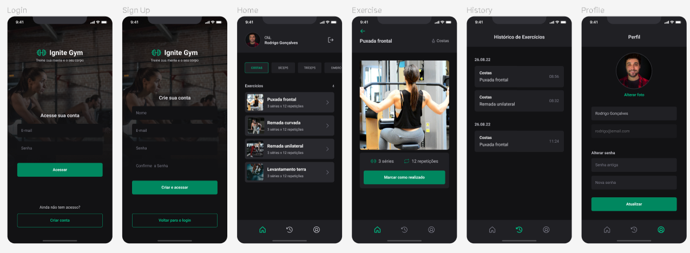

# Ignite Gym

<div align="center">
	
</div>

## :dart: Objetivo

Projeto com a proposta de ajudar no gerenciamento de treinos na academia por parte do usuário, desenvolvido com o
conteúdo estudado nas aulas do Chapter III da trilha de React Native do Bootcamp Ignite da Rocketseat.

## :hammer_and_wrench: Ferramentas

- [@react-native-async-storage/async-storage](https://www.npmjs.com/package/@react-native-async-storage/async-storage)
- [@react-navigation/bottom-tabs](https://reactnavigation.org/docs/bottom-tab-navigator/)
- [@react-navigation/native-stack](https://reactnavigation.org/docs/native-stack-navigator/)
- [Axios](https://www.npmjs.com/package/axios)
- [Expo](https://expo.dev/)
- [Expo-file-system](https://docs.expo.dev/versions/latest/sdk/filesystem/)
- [Expo-image-picker](https://docs.expo.dev/versions/latest/sdk/imagepicker/)
- [Native-base](https://nativebase.io/)
- [React-hook-form](https://react-hook-form.com/)
- [Yup](https://www.npmjs.com/package/yup)

## :desktop_computer: Padronização de código

- [Eslint](https://eslint.org/)
- [Prettier](https://prettier.io/)
- [EditorConfig](https://editorconfig.org/)

## :rocket: Executando o projeto

```bash
// Instale as dependências

yarn install

// Concluindo a instalação rode

yarn android
```
